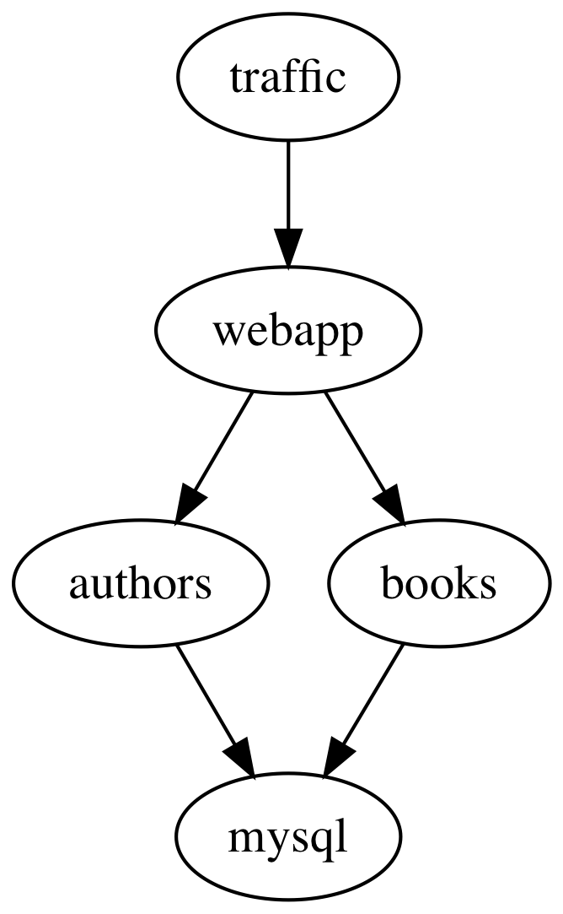
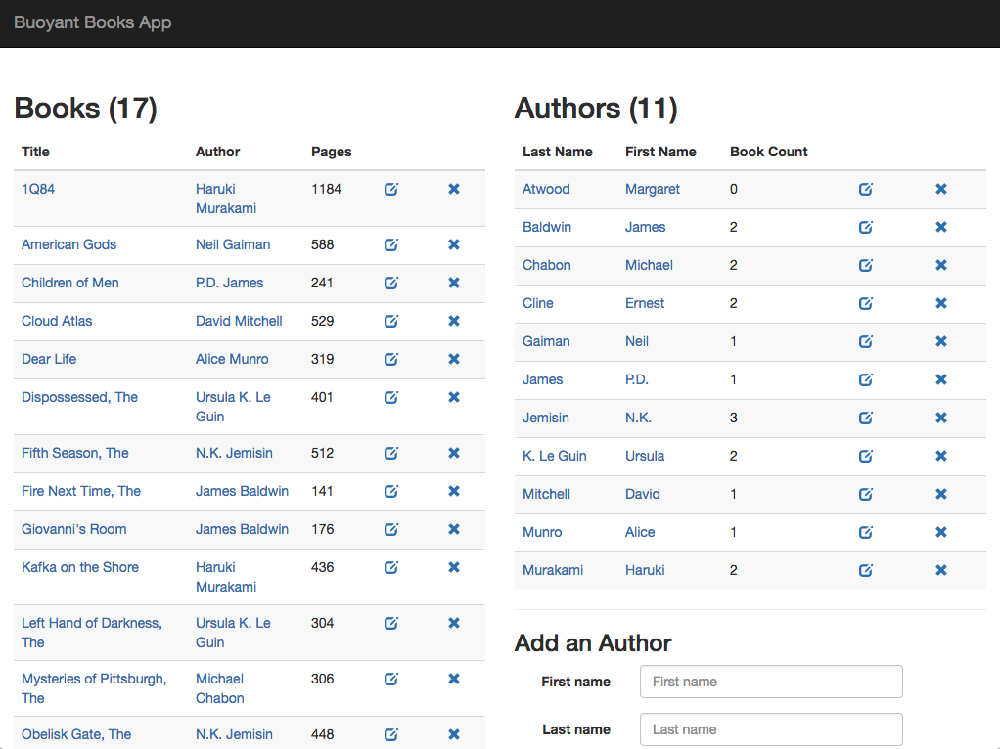

To get started, let's install the demo app on your cluster:

`kubectl create ns booksapp`{{execute}}
`curl https://run.linkerd.io/booksapp.yml | kubectl -n booksapp apply -f -`{{execute}}

This command creates a namespace for the demo, downloads its Kubernetes manifest
and uses kubectl to apply it to your Kubernetes cluster. The app is comprised
of several services that run in the `booksapp` namespace.

Downloading a bunch of containers and starting mysql up for the first time
takes a little while. Kubernetes can tell you when all the services are running
and ready for traffic. Wait for that to happen by running:

`kubectl -n booksapp rollout status deploy/webapp`{{execute}}

Once this has returned, you can look at what is running with:

`kubectl -n booksapp get all`{{execute}}

The topology looks like this:

There's a traffic generator (`traffic`), a frontend (`webapp`), a backend for
authors (`authors) and one for books (`books`).

To take a look at your books management application, run:

`kubectl -n booksapp port-forward svc/webapp 9091:7000 > /dev/null &`{{execute}}

Then you can [open books-app](https://[[HOST_SUBDOMAIN]]-9091-[[KATACODA_HOST]].environments.katacoda.com/)
and see what's going on in your browser. Try adding a couple books and see what
happens (spoiler, it will fail about 50% of the time)!

Let's see how you can use Linkerd to narrow down the root cause from this issue.
