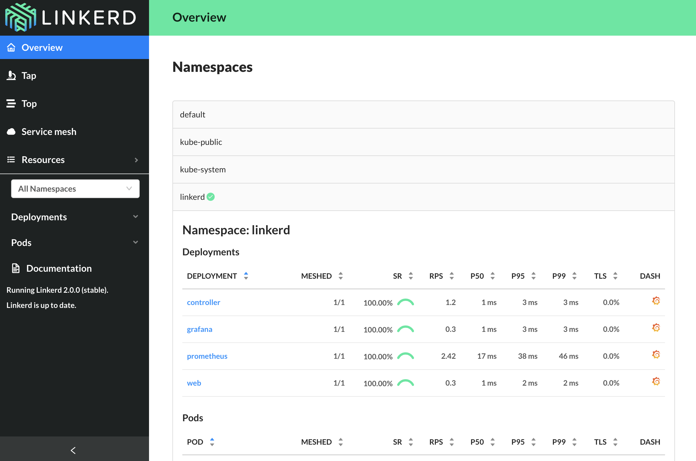

With the control plane installed and running, you can now view the Linkerd
dashboard. Normally you'd get to that by running `linkerd dashboard`. Because
this tutorial is running in Katacoda, we need to do a little extra work. Run:

`. expose-dashboard.sh`{{execute}}

This will start the dashboard and setup a tunnel for you to view it from.
Copy the link and paste it into your browser.

The control plane components all have the proxy installed in their pods and are
part of the data plane itself. This provides the ability to dig into the control
plane's components and see what is going on behind the scenes. While you're
viewing the dashboard in your browser, run:

`linkerd -n linkerd top deploy/web`{{execute}}

This is a `top` view of all the traffic you're generating by looking at the
dashboard itself! Imagine what you could do with data like this on your own
services. Let's do exactly that for a demo app next.
