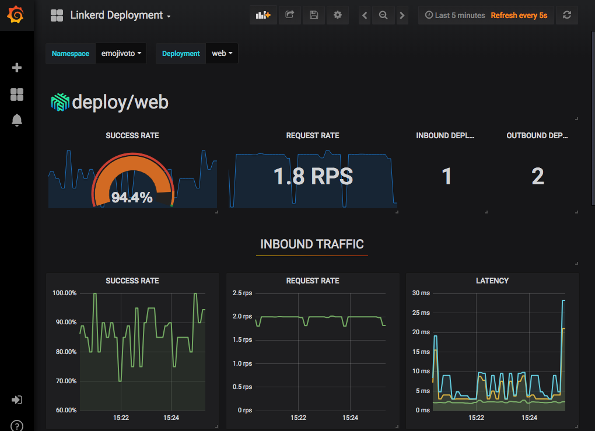
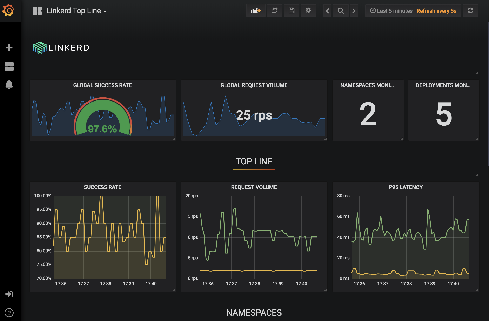

Linkerd provides some standard dashboards right out of the box. This is a
great heads up view into the health of a service that can be used for monitoring
and as a basis for alerting.

You can open the [emojivoto dashboard](https://[[HOST_SUBDOMAIN]]-9093-[[KATACODA_HOST]].environments.katacoda.com/api/v1/namespaces/linkerd/services/grafana:http/proxy/d/6svnwykmk/linkerd-deployment?refresh=5s&orgId=1&var-namespace=emojivoto&var-deployment=web&var-inbound=All&var-outbound=All)
and see what's going on in your browser.

At the top of the screen is a dropdown with many different dashboards. Take a
look around! Another interesting dashboard is the [top line](https://[[HOST_SUBDOMAIN]]-9093-[[KATACODA_HOST]].environments.katacoda.com/api/v1/namespaces/linkerd/services/grafana:http/proxy/d/XKy9QWRmz/linkerd-top-line?refresh=5s&orgId=1) dashboard.

