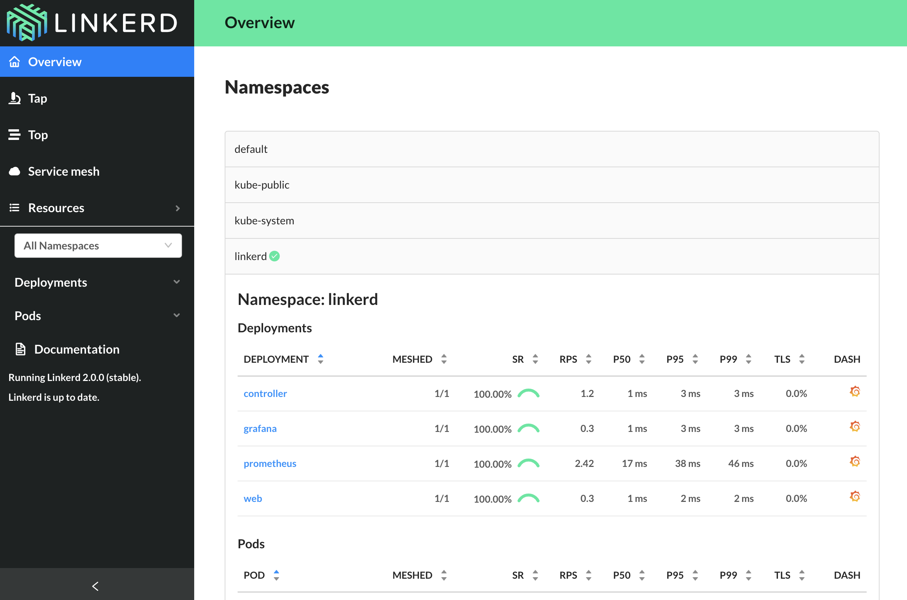

Linkerd works by installing ultralight [proxies](https://linkerd.io/2/architecture#proxy)
into each pod of a service. These proxies become part of a
[data plane](https://linkerd.io/2/architecture#data-plane) which reports
telemetry data to, and receives signals from, a
[control plane](https://linkerd.io/2/architecture#control-plane). This means
that using Linkerd doesn’t require any code changes, and can even be installed
live on a running service.

Linkerd has three basic components: a UI, a data plane and a control plane. You
run Linkerd by:

- Installing the CLI on your local system.
- Using the CLI to install the control plane into your cluster.
- Adding Linkerd's data plane to each service you would like.

Take a look at the [architecture documentation](https://linkerd.io/2/architecture/)
for more details.

Let's get started by installing the CLI:

`curl https://run.linkerd.io/install | sh`{{execute}}

Next, add Linkerd to your path with:

`export PATH=$PATH:$HOME/.linkerd2/bin`{{execute}}

Use the CLI to verify that your cluster is compatible with Linkerd by running:

`linkerd check --pre`{{execute}}

After everything passes, it is time to install the control plane:

`linkerd install | kubectl apply -f -`{{execute}}

`linkerd install` generates a list of Kubernetes resources. Run it standalone
if you would like to understand what is going on. By piping the output of
`linkerd install` into `kubectl`, the Linkerd control plane resources will be
added to your cluster and start running immediately.

It may take a minute or two for your Kubernetes cluster to pull the Linkerd
images and start all the components. While that’s happening, we can validate
that everything’s happening correctly by running:

`linkerd check`{{execute}}

At this point, you'd normally run `linkerd dashboard`. Because this tutorial is
running in Katacoda, we need to do a little extra work. Run:

`. expose-dashboard.sh`{{execute}}

This will start the dashboard and setup a tunnel for you to view it from.
Copy the link and paste it into your browser. This will pull up the Linkerd
dashboard for you.

Next up: check out all those sweet dashboards that show what is going on!
