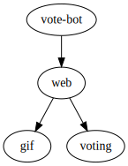
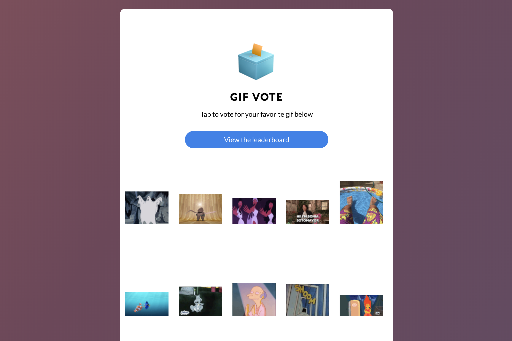

To get started, let's install the demo app on your cluster:

`curl https://run.linkerd.io/nodevoto.yml | kubectl apply -f -`{{execute}}

This command fetches the Kubrernetes config for an example application that
allows voting for gifs.

First, let's wait until everything is running. You can do that with:

`kubectl -n nodevoto rollout status deploy/web`{{execute}}

Once this has returned, you can look at what is running with:

`kubectl -n nodevoto get all`{{execute}}

The topology looks like this:

There's a traffic generator (vote-bot), a web frontend (web), a backend to
record votes (voting) and an index of gifs (gif).

To take a look at your new gif voting application, run:

`kubectl -n nodevoto port-forward svc/web-svc 9090:80 > /dev/null &`{{execute}}

Then you can [open nodevoto](https://[[HOST_SUBDOMAIN]]-9091-[[KATACODA_HOST]].environments.katacoda.com/)
and see what's going on in your browser. Try clicking on the first gif to vote
for it and see what happens (spoiler, it will fail about 50% of the time)!

Let's see how you can use Linkerd to narrow down the root cause from this issue.
